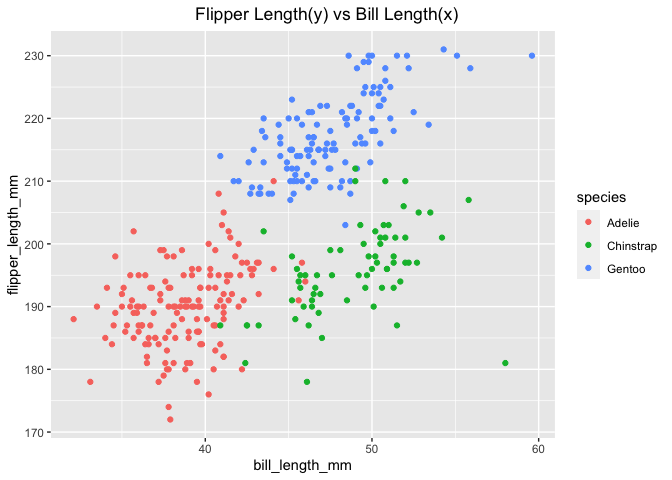

p8105\_hw1\_js5962
================
Jiayao Sun
2021-09-28

# Problem 1

-   Create a data frame comprised of:
    -   a random sample of size 10 from a standard Normal distribution
    -   a logical vector indicating whether elements of the sample are
        greater than 0
    -   a character vector of length 10
    -   a factor vector of length 10, with 3 different factor “levels”

Solution :

1.  create the data frame

``` r
set.seed(1234)

hm1_df = tibble(
  vec_numeric = rnorm(10),
  vec_logical = c(vec_numeric > 0),
  vec_char = c("a", "b", "c", "d", "e", "f", "g","h", "i", "j"),
  vec_factor = factor(c("level 1", "level 2", "level 3", "level 1", "level 2", "level 3","level 1", "level 2", "level 3", "level 1"))
)
hm1_df
```

    ## # A tibble: 10 × 4
    ##    vec_numeric vec_logical vec_char vec_factor
    ##          <dbl> <lgl>       <chr>    <fct>     
    ##  1      -1.21  FALSE       a        level 1   
    ##  2       0.277 TRUE        b        level 2   
    ##  3       1.08  TRUE        c        level 3   
    ##  4      -2.35  FALSE       d        level 1   
    ##  5       0.429 TRUE        e        level 2   
    ##  6       0.506 TRUE        f        level 3   
    ##  7      -0.575 FALSE       g        level 1   
    ##  8      -0.547 FALSE       h        level 2   
    ##  9      -0.564 FALSE       i        level 3   
    ## 10      -0.890 FALSE       j        level 1

2.  If we take the mean of each variable in your dataframe

<!-- -->

    ## [1] -0.3831574

    ## [1] 0.4

    ## Warning in mean.default(pull(hm1_df, vec_char)): argument is not numeric or
    ## logical: returning NA

    ## [1] NA

    ## Warning in mean.default(pull(hm1_df, vec_factor)): argument is not numeric or
    ## logical: returning NA

    ## [1] NA

Thus the number and logical vectors works for mean. The characters and
factors do not work.

3.  Then we convert logical, character and factor vectors into numbers.
    *Do not show the output*

``` r
 x = as.numeric(pull(hm1_df, vec_logical))
 y = as.numeric(pull(hm1_df, vec_char))
```

    ## Warning: NAs introduced by coercion

``` r
 z = as.numeric(pull(hm1_df, vec_factor))
```

4.  Take the mean again

<!-- -->

    ## [1] -0.3831574

    ## [1] 0.4

    ## [1] NA

    ## [1] 1.9

After converting, the logical vector remains the same, which is **True =
1** and **False = 0**. The factor vector generates the numerical mean.
But the character variable cannot be converted into numbers and are left
as NA.

# Problem 2

1.  Download the a package containing the penguins data set (done in
    console)
2.  

``` r
data("penguins", package = "palmerpenguins")
```

-   The **Penguins data set** has the following variables:
    bill\_depth\_mm, bill\_length\_mm, body\_mass\_g,
    flipper\_length\_mm, island, sex, species, year.

    -   Bill depth (in mm), *the numeric variable*, has a mean of
        17.1511696, a median of 17.3, and a range of 13.1, 21.5 (min,
        max).
    -   Bill length (in mm), *the numeric variable*, has a mean of
        43.9219298, a median of 44.45, and a range of 32.1, 59.6 (min,
        max).
    -   Body mass (in g), *the integer variable*, has a mean of
        4201.754386, a median of 4050, and a range of 2700, 6300 (min,
        max).
    -   flipper\_length (in mm), *the integer variable*, has a mean of
        200.9152047 and a range of 172, 231 (min, max).
    -   Island, *the factor variable*, has Biscoe, Dream, Torgersen
        islands.
    -   Sex, *the factor variable*, has female, male categories.
    -   Species, *the factor variable*, has Adelie, Chinstrap, Gentoo
        species.
    -   Year, *the integer variable*. has a range of year 2007, 2009.

The Penguin data set has 344 rows and 8 columns. The mean flipper length
is \`r mean(pull(penguins, flipper\_length\_mm).

3.  Make a scatterplot of flipper\_length\_mm (y) vs
    bill\_length\_mm (x) and save it.

``` r
library(ggplot2)
set.seed(1234)
ggplot(penguins, aes(x = bill_length_mm, y = flipper_length_mm, color = species)) + geom_point() + ggtitle("Flipper Length(y) vs Bill Length(x)") + theme(plot.title = element_text(hjust = 0.6))
```

    ## Warning: Removed 2 rows containing missing values (geom_point).

<!-- -->

``` r
ggsave("scatterplot_Problem2.pdf")
```

    ## Saving 7 x 5 in image

    ## Warning: Removed 2 rows containing missing values (geom_point).
